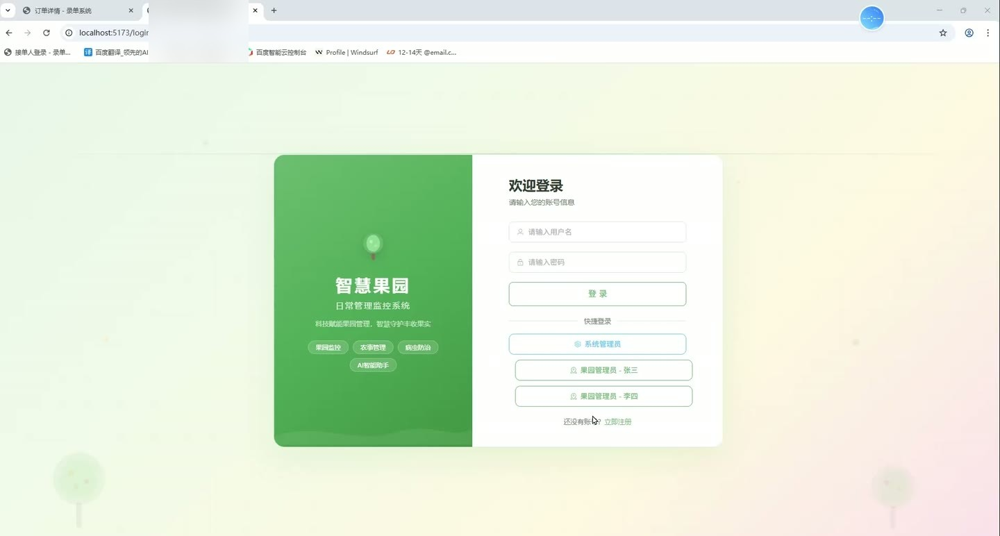
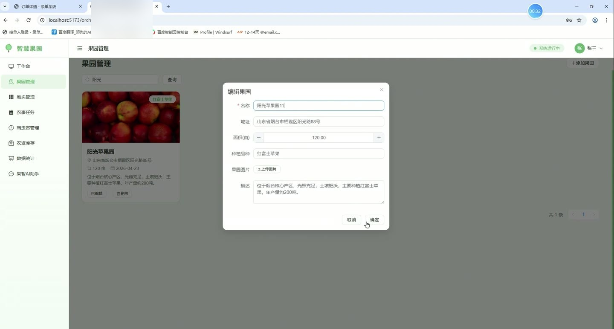
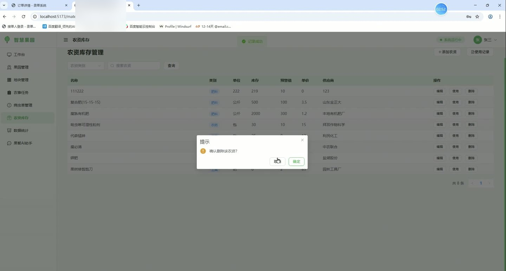
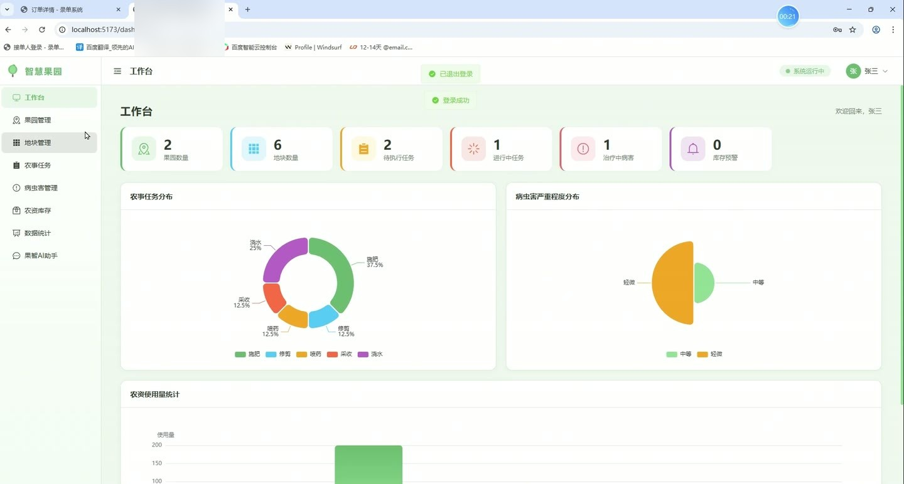
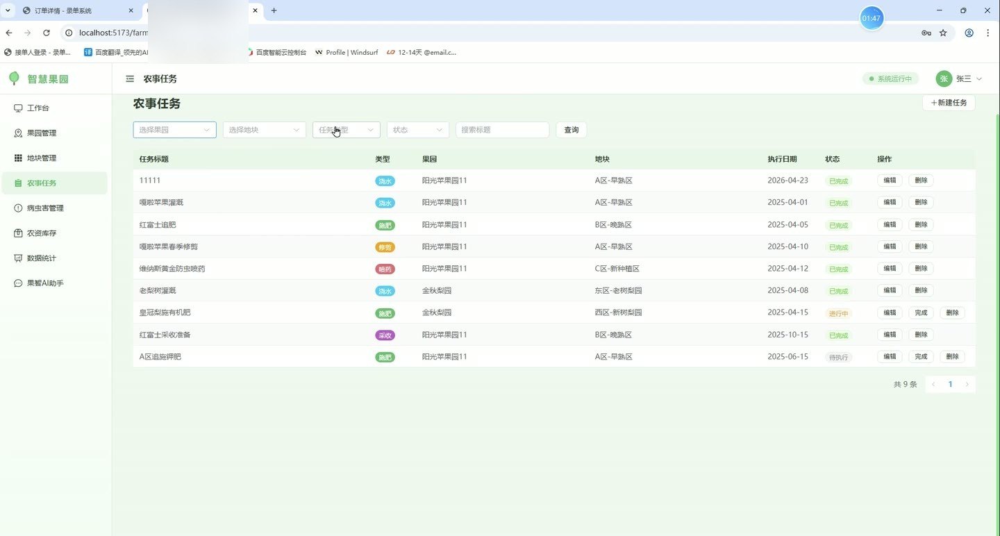

# (附文档)Springboot3+Vue3+MySQL 智慧果园日常管理监控系统

**技术栈**：Springboot3、Vue3、MySQL

### 系统简介

智慧果园日常管理监控系统是一套基于 Spring Boot 3 + Vue 3 前后端分离架构的果园综合管理平台。系统支持普通管理员与超级管理员两种角色，提供果园/地块管理、农事任务分配、病虫害记录、农资库存监控、数据统计看板以及 AI 智能问答助手等功能，帮助果园经营者实现数字化、精细化的日常管理。
 
### 核心功能
 
### 普通用户端

 
- 登录/注册：支持用户名密码登录，新用户可自助注册，注册后自动分配普通管理员角色。 
- 工作台概览：以卡片形式展示果园数量、地块数量、待执行任务、进行中任务、治疗中病害、库存预警数量等关键指标。 
- 农事任务分布图：以饼图展示浇水、施肥、修剪、喷药、采收等任务类型的数量占比。 
- 病虫害严重度分布图：以玫瑰图展示轻微、中等、严重三个等级的病虫害记录占比。 
- 农资使用量统计图：以柱状图展示各农资物料的使用总量。 
- 果园管理：支持新增果园（填写名称、地址、面积、水果类型、描述、图片），支持分页列表查看、编辑、删除，支持按名称关键词搜索。 
- 地块管理：支持新增地块（关联果园、填写名称、面积、水果类型、植株数量、定植日期、状态），支持分页列表查看、编辑、删除，支持按果园筛选和关键词搜索。 
- 农事任务管理：支持新增任务（填写标题、类型、关联果园/地块、执行日期、状态、内容、备注），支持分页列表查看、编辑、标记完成、删除，支持按果园/地块/类型/状态/关键词筛选。 
- 病虫害记录管理：支持新增记录（填写病害名称、严重度、描述、治疗方案、治疗日期、治疗结果、图片），支持分页列表查看、编辑、删除，支持按果园/地块/严重度/关键词筛选。 
- 农资库存管理：支持新增物料（填写名称、类别、单位、库存量、预警库存、单价、供应商、描述），支持分页列表查看、编辑、删除，支持按类别/名称搜索。 
- 农资使用记录：支持新增使用记录（选择物料、关联果园/地块、填写用量、使用日期、用途、备注），提交后自动扣减对应物料库存。 
- 库存预警列表：自动列出当前库存量小于等于预警库存的物料，便于及时补货。 
- 数据统计：提供果园数、地块数、任务总数、待执行任务数、进行中任务数、病害记录数、治疗中病害数、物料总数、库存预警数等概览数据。 
- 果智 AI 助手：支持向 DeepSeek 大模型发送果园管理相关问题（如修剪时间、病虫害防治、施肥方案、灌溉技术、农资优化、采收时机等），AI 以专业果园顾问身份回复。 
- 个人中心：查看个人信息，支持修改真实姓名、手机、邮箱、头像，支持修改密码（需验证原密码）。 
- 文件上传：支持上传图片等文件，返回可访问的 URL 地址。
 
### 管理员端

 
- 用户管理：分页查看所有用户列表（支持按用户名/姓名关键词搜索，按角色筛选），支持新增用户、编辑用户信息、启用/禁用账号、删除用户。 
- 操作日志：分页查看系统操作日志（支持按操作内容/用户名搜索），记录用户登录等关键操作。 
- 系统配置：查看和修改系统配置项（键值对形式），支持编辑配置值。
 
### 技术栈

 后端框架Spring Boot 3.2 ORMMyBatis-Plus 3.5.5 权限认证JWT（自定义拦截器，基于角色 ADMIN/MANAGER 校验） 前端框架Vue 3（Composition API） 状态管理Vue Router（基于角色路由守卫） UI 组件库Element Plus 图表库ECharts 5 构建工具Vite 数据库MySQL 8 HTTP 客户端OkHttp（AI 接口调用）
 
### 交付内容

 
- 后端完整源码 
- 前端完整源码 
- 数据库初始化脚本 
- 万字文档

## 界面展示

---

## 获取完整源码 + 万字文档

本仓库为项目介绍页。**完整前后端源码、数据库初始化脚本、万字项目文档**，请加微信 `kangkangcode`，或访问 [codekk.top](http://codekk.top) 获取。

可作课程设计 / 毕业设计参考，支持远程部署调试。